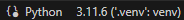

# python environment testing
## documented steps
1. Visited https://www.python.org/downloads/windows/ downloaded python (3.11.#)
2. `add to PATH` was selected in the installation to add system variable
3. Created a `.py` file within vscode and confirmed interpreter was detected



4. Created a local virtual environment using the terminal (ctrl + shift + ')

```
python -m venv .venv
.venv\scripts\activate
```


`Note:` if there was a requirements.txt file the next command might be run

```
python -m pip install -r requirements.txt
```

5. Manual import of modules if required 

```
python -m pip install requests
```


```
python -m pip install --upgrade pip
```


